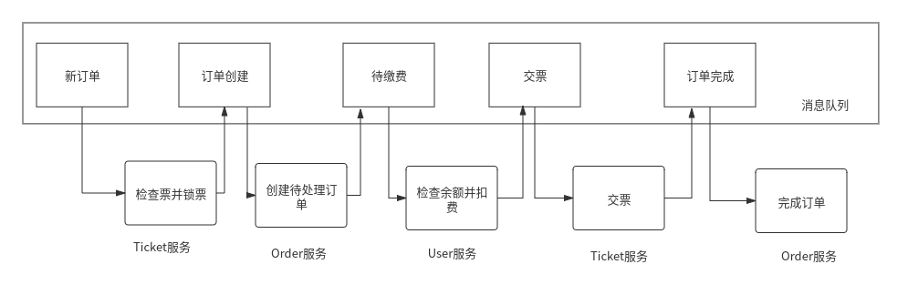

# 分布式事务

## 1 消息驱动的分布式事务实现

## 2 分布式事务实现方式比对
实现方式|一致性|业务侵入性|优点|缺点
-|-|-|-|-
XA/JTA|强一致性|几乎跟使用本地数据库一样，只需要配置JTA的事务管理器|易使用|事务周期太长，易阻塞，吞吐量低
TCC|最终一致性|非常强，需要实现大量接口|性能高、吞吐量高|跟TCC框架绑定紧密，需要在业务代码中实现大量补偿业务
最大努力一次提交|弱一致性|无侵入|简单，性能高，适用于短事务|需要自己实现超时、回滚等
消息驱动模式|最终一致性|开发模式需要改变，使用事件驱动架构进行设计|性能高，吞吐量高，适用于长事务|需要自己实现超时、回滚等
Saga|最终一致性|开发模式需要改变，使用事件驱动架构进行设计|性能高，吞吐量高，适用于长事务|流程设计较复杂，跟Saga实现框架绑定
